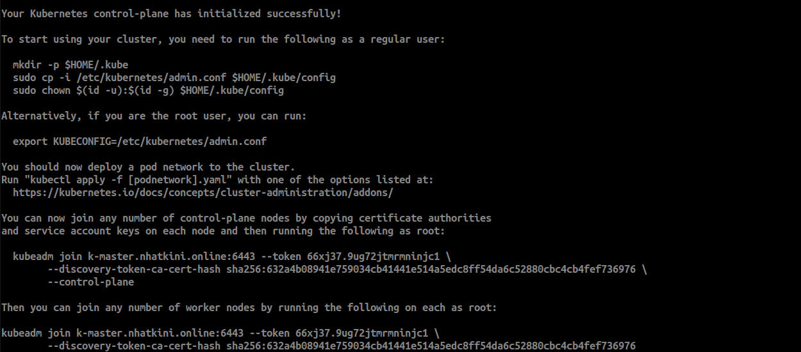
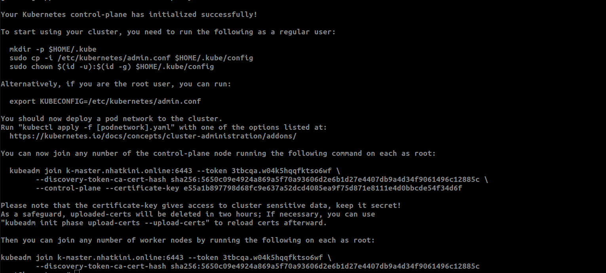
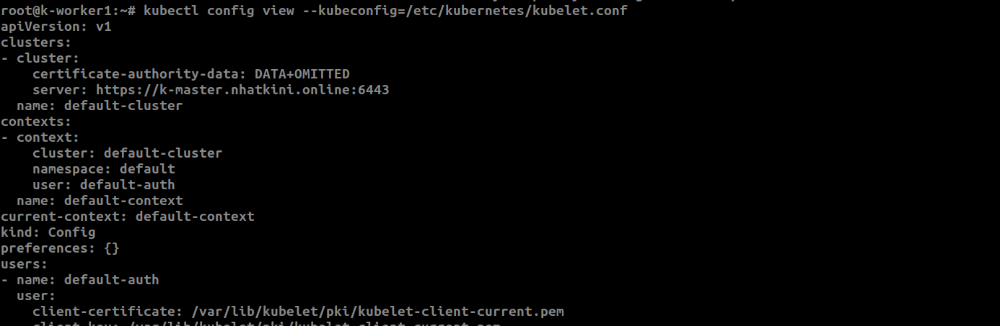
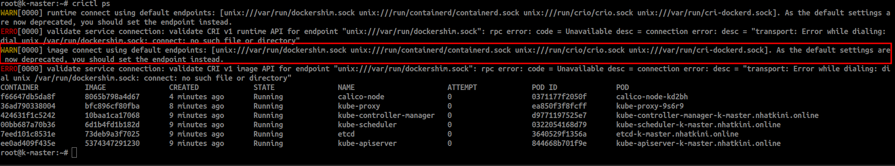
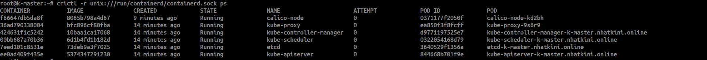

# LAB01-Install-Kubernetes

1. [Nội dung lab](#contents)

2. [Các cài đặt chung](#setup)

3. [Master](#master)

4. [Worker](#worker)

5. [Các vấn đề  phát sinh khi lab](#problem)

    5.1. [CRI](#problem-cri)

      5.1.1.[crio.sock](#pcri)

      5.1.2.[containerd.sock](#pcontainerd)

      5.1.3.[dockershim.sock](#pdockershim)

      5.1.4.[Nên dùng khi nào?](#when-use)

      5.1.5.[Kiểm tra cri](#check-cri)

    5.2. [IP](#problem-ip)

6. [Tổng kết một số cmd đáng chú ý](#sumary-cmd)

## 1. Nội dung lab <a name="contents"></a>

Hostname & Vai trò | Thông tin | IP
:---------:|:----------:|:---------:
 k-master.nhatkini.online | HĐH Ubuntu 20.04, Docker CE, Kubernetes | 222.255.214.25
 k-worker1.nhatkini.online | HĐH Ubuntu 20.04, Docker CE, Kubernetes | 103.90.224.251
 k-worker2.nhatkini.online | HĐH Ubuntu 20.04, Docker CE, Kubernetes | 103.90.225.65

## 2. Các cài đặt chung <a name="setup"></a>

* Update

```bash
apt update && apt upgrade -y
timedatectl set-timezone Asia/Ho_Chi_Minh
apt-get install vim htop net-tools wget curl gnupg2 software-properties-common apt-transport-https ca-certificates -y
```

* Tắt swap

```bash
sed -i '/ swap / s/^\(.*\)$/#\1/g' /etc/fstab
swapoff -a
mount -a
```

* Đặt hostname tương ứng với các node tương ứng

  * master

```bash
hostnamectl set-hostname "k-master.nhatkini.online"
```

  * k-worker1

```bash
hostnamectl set-hostname "k-worker1.nhatkini.online"
```

  * k-worker2

```bash
hostnamectl set-hostname "k-worker2.nhatkini.online"
```

* Thêm nội dung vào file /etc/hosts

```bash
echo -e "
222.255.214.25   k-master.nhatkini.online   k-master
103.90.224.251   k-worker1.nhatkini.online  k-worker1
103.90.225.65    k-worker2.nhatkini.online  k-worker2
" >> /etc/hosts 

```

* Cài đặt 1 số  file và update system:

```bash
tee /etc/modules-load.d/containerd.conf <<EOF
overlay
br_netfilter
EOF

tee /etc/sysctl.d/kubernetes.conf <<EOF
net.bridge.bridge-nf-call-ip6tables = 1
net.bridge.bridge-nf-call-iptables = 1
net.ipv4.ip_forward = 1
EOF


modprobe overlay
modprobe br_netfilter
sysctl --system
```

* Cài đặt containerd

```bash
curl -fsSL https://download.docker.com/linux/ubuntu/gpg | sudo gpg --dearmour -o /etc/apt/trusted.gpg.d/docker.gpg
add-apt-repository "deb [arch=amd64] https://download.docker.com/linux/ubuntu $(lsb_release -cs) stable"

apt update && apt install -y containerd.io
containerd config default | sudo tee /etc/containerd/config.toml >/dev/null 2>&1
sed -i 's/SystemdCgroup \= false/SystemdCgroup \= true/g' /etc/containerd/config.toml
systemctl enable containerd --now
systemctl restart containerd 
```

* Cài đặt kubernetes

```bash
curl -s https://packages.cloud.google.com/apt/doc/apt-key.gpg | sudo gpg --dearmour -o /etc/apt/trusted.gpg.d/kubernetes-xenial.gpg
apt-add-repository "deb http://apt.kubernetes.io/ kubernetes-xenial main"
apt update
apt install -y kubelet kubeadm kubectl
apt-mark hold kubelet kubeadm kubectl
systemctl enable kubelet --now

```

## 3. Master <a name="master"></a>

* Khởi tạo
  * Khởi tạo này sẽ tạo ra cluster với cri là containerd

  ```bash
  kubeadm init --control-plane-endpoint=k-master.nhatkini.online --pod-network-cidr=192.168.0.0/16 --apiserver-advertise-address=222.255.214.25
  ```

  * Có thể chuyển sang các cri khác tùy theo nhu cầu

* Sau khi quá trình cài đặt sẽ  hiện thị output như hình ảnh

  * Hình ảnh khi không có option: **--upload-certs**
  

  * Hình ảnh khi có thêm option: **--upload-certs**
  
    * Việc có thêm option: **--upload-certs** sẽ dẫn đến nhiều thao tác phức tạp, nên nếu không có kiến thức chuyên môn thì đừng nên thêm vào

* Khi nhận được hiển thị như hình ảnh trên cần thực hiện chạy 1 số  cmd như output mà kubernetes xuất ra

```bash
mkdir -p $HOME/.kube
cp -i /etc/kubernetes/admin.conf $HOME/.kube/config
chown $(id -u):$(id -g) $HOME/.kube/config
```

* Cài đặt plugin mạng Calico

```bash
kubectl apply -f https://docs.projectcalico.org/manifests/calico.yaml
```

* Kiểm tra lại Cluster

```bash
kubectl get nodes
```

* Bạn sẽ thấy danh sách các node và trạng thái của chúng.

* Với đó, bạn đã cài đặt thành công một cluster Kubernetes với 1 node master và 2 node worker, sử dụng plugin mạng Calico.

## 4. Worker (worker1 & worker2) <a name="worker"></a>

* Thêm các Node vào Cluster

Chạy lệnh này trên cả hai node worker (worker1 và worker2). Lệnh này sẽ được hiển thị ở cuối của quá trình kubeadm init ở node master:

```bash
kubeadm join k-master.nhatkini.online:6443 --token dunacz.l79nzv2ec8u3di5v \
--discovery-token-ca-cert-hash sha256:66f21ab537f18f7227e2974164bff2e0beed2c95c1e351411b242d9271972b43 \
--control-plane --certificate-key 597849a34d97b462cd4c47d6b1d8e0e70155dbed67f1e1bc1bf3eff3408c4fdf

```

hoặc

```bash
kubeadm join k-master.nhatkini.online:6443 --token msiwq5.zc0uckmyi6f0grhd \
--discovery-token-ca-cert-hash sha256:3b1d6e4c3420e79948fea234549f98e37adeb4af22e4e5e8dc51f49f45f81e5a
```

* Kiểm tra xem worker đang join vào cluster nào

```bash
kubectl config view --kubeconfig=/etc/kubernetes/kubelet.conf
```

  

## 5. Các vấn đề  phát sinh khi lab  <a name="problem"></a>

### 5.1 CRI <a name="problem-cri"></a>

* Gặp lỗi về CRI, cần phân biệt về  các cri
* Nếu có nhiều Container Runtime Interface (CRI) cần truyền cri được sử  dụng cho cho kubernetes. 1 số cri thông dụng

### 5.1.1 --cri-socket="/var/run/crio/crio.sock" <a name="pcri"></a>

Là một dự án lightweight mà đặc biệt dành riêng cho việc chạy container trong Kubernetes. CRI-O chỉ hỗ trợ những tính năng cần thiết cho Kubernetes và không bao gồm các tính năng không cần thiết. (Hiểu đơn giản bản base)

### 5.1.2 --cri-socket="/run/containerd/containerd.sock" <a name="pcontainerd"></a>

* Là một dự án dưới b umbrella của CNCF, containerd là một runtime daemon mà có thể được sử dụng để chạy container. Docker cũng sử dụng containerd ở tần dưới.
* Đa phần kubernetes sử  dụng cri này. (Hiểu đơn giản bản full)

### 5.1.3 --cri-socket="/run/containerd/dockershim.sock" <a name="pdockershim"></a>

* CRI được hỗ  trợ khi cài đặt docker.io và docker khi không cài đặt containerd.io
* CRI này không ưu tiên sử  dụng.

#### 5.1.4 Nên dùng khi nào? <a name="when-use"></a>

* **CRI-O**: Bạn có thể chọn CRI-O khi bạn muốn một giải pháp được tối ưu hóa đặc biệt cho Kubernetes, hoặc khi bạn cần các tính năng hoặc cấu hình đặc biệt chỉ có sẵn trong CRI-O.

* **Containerd**: Nếu bạn muốn một giải pháp runtime container thông dụng và linh hoạt, hoặc nếu bạn đã quen với Docker và muốn chuyển đến một giải pháp nguyên thuần mà vẫn giữ được một số tính năng tương tự, containerd có thể là lựa chọn tốt.

Cả hai runtime đều là lựa chọn tốt, và chúng được hỗ trợ rộng rãi trong cộng đồng Kubernetes. Sự lựa chọn giữa chúng thường phụ thuộc vào các yêu cầu và ưu tiên cụ thể của bạn.

* **Docker (qua dockershim)**: Không ưu tiên sử dụng

### 5.1.5 Kiểm tra cri <a name="check-cri"></a>

```bash
#Cài đặt
wget https://github.com/kubernetes-sigs/cri-tools/releases/download/v1.28.0/crictl-v1.28.0-linux-amd64.tar.gz

#Giải nén
tar -xf crictl-v1.28.0-linux-amd64.tar.gz -C /bin/

#Cấp quyền thực thi
chmod +x /bin/crictl
```

* Kiểm tra các cri đang hoạt động

```bash
crictl ps
```



* Kiểm tra các container đang hoạt động trên cri đang sử  dụng (bài lab đang dùng cri: containerd.sock)

```bash
crictl -r unix:///run/containerd/containerd.sock ps
```



Tham khảo từ 1 số link sao:

* <https://github.com/kubernetes-sigs/cri-tools>
* <https://github.com/kubernetes-sigs/cri-tools/releases>

* <https://github.com/kubernetes-sigs/cri-tools/issues/1089>

* <https://github.com/Mirantis/cri-dockerd>

### 5.2 IP <a name="problem-ip"></a>

Có 1 số hướng dẫn lab về việc tạo tạo cluster và join cluster vào kubernetes với trường network **--apiserver-advertise-address=172.16.10.100** thì yêu cầu cần add thêm ip tương ứng vào card mạng để không bị lỗi

## 6. Tổng kết một số  cmd đáng chú ý <a name="contents"></a>

```bash
#Create cluster

#Setup calico network
kubectl apply -f https://docs.projectcalico.org/manifests/calico.yaml

# Thiết lập file cấu hình kubectl sử dụng cho 1 phiên làm việc hiện tại của termianl
export KUBECONFIG=/etc/kubernetes/admin.conf

# Lấy mã kết nối vào Cluster
kubeadm token create --print-join-command

#see this node join the cluster
kubectl get nodes

# Thông tin cluster
kubectl cluster-info

# Các node (máy) trong cluster
kubectl get nodes

# Các pod (chứa container) đang chạy trong tất cả các namespace
kubectl get pods -A

# Xem nội dung cấu hình hiện tại của kubectl
kubectl config view

# Các ngữ cảnh hiện có trong config
kubectl config view

# Đổi ngữ cảnh làm việc (kết nối đến cluster nào)
kubectl config use-context kubernetes-admin@kubernetes
```
