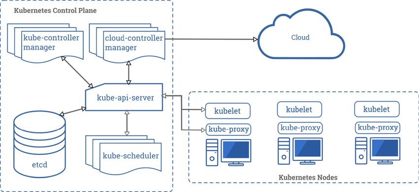

# Tự Học Kubernetes

I. [Lý thuyết](#ly-thuyet)

1.1. [Master](#master)
    1.1.1. [api-server](#api-server)
    1.1.2. [etcd](#etcd)
    1.1.3. [Kube Controller Manage](#kube-controller-manage)
    1.1.4. [Cloud Controller Manager](#cloud-controller-manage)
    1.1.5. [Scheduler](#scheduler)

1.2. [Worker](#worker)
    1.2.1. [kube-proxy](#kube-proxy)
    1.2.2. [kubelet](#kubelet)
    1.2.3. [Container Runtime](#container-runtime)

2. [Những khái niệm cơ bản quan trọng trong Kubernetes](#khai-niem)
    2.1. [Pods](#pods)
    2.2. [Services](#services)
    2.3. [Labels](#labels)
    2.4. [Annotations](#annotations)
    2.5. [ReplicaSets](#replicaSets)
    2.6. [StatefulSets](#statefulSets)
    2.7. [ConfigMaps](#configMaps)
    2.8. [Secrets](secrets)
    2.9. [Namespaces](#namespaces)

3. [Môi trường cài đặt Kubernetes](#enviroment)

II. [Lab Build On Virtual Machine/VPS](#lab-on-vps)

1.1. [LAB01-Install-Kubernetes](#lab01)

1.2. [LAB02-Dashboard](#lab02)

1.3. [LAB03-K9S](#lab03)

1.4. [LAB04-Pod,Node,kubectl](#lab04)

1.5. [LAB05-ReplicaSet-HPA](#lab05)

1.6. [LAB06-Deployment](#lab06)

1.7. [LAB07-Service-Secret](#lab07)

1.8. [LAB08-DaemonSet-Job-CronJob](#lab08)

1.9. [LAB09-PersistentVolume-NFS](#lab09)

1.10. [LAB10-Ingress-HAProxy-Ingress](#lab10)

1.11. [LAB11-Ingress-NGINX-Ingress](#lab11)

1.12. [LAB12-Rancher 2](#lab12)

## I. Lý thuyết 

* Kiến trúc Kubernetes bao gồm hệ thống Kubernetes Cluster.
* Kubernetes Cluster được chia ra làm 2 khối: Mastrar(Control plane) và Worker. Mỗi khối này sẽ có các vai trò và chức năng khác nhau.

### 1.1 Master 

Đối với cluster nhỏ , Master có thể chạy trên một Node, nhưng trong một cluster lớn, để đảm bảo tính khả dụng (trong tiếng anh là High-Availability) thì Master có thể được chạy trên nhiều Node. (Tính khả dụng có nghĩa là Khi mà một Node trong cluster dừng hoạt động thì hệ thống vẫn duy trì như không có gì xảy ra). Master sẽ bao gồm 5 thành phần chính sau

### 1.1.1 api-server 

Cung cấp REST API cho Kubernetes Cluster dùng để xác thực và thiết lập configuration data cho các objects như Pods, Services. Etcd: Là Key-value Storage có tính khả dụng cao được sử dụng để lưu trữ toàn bộ cấu hình, trạng thái và metadata của Kubernetes Cluster. Trong các cluster nhỏ, etcd có thể chạy trên cùng một Node với các thành phần khác. Nhưng trong các cluster lớn, etcd có thể chạy dự phòng trên nhiều Node để đảm bảo tính khả dụng của toàn hệ thống.

### 1.1.2 etcd 

Là Key-value Storage được sử dụng để lưu trữ toàn bộ cấu hình, trạng thái và metadata của Kubernetes Cluster. Trong các cluster nhỏ, etcd có thể chạy trên cùng một Node với các thành phần khác. Nhưng trong các cluster lớn, etcd có thể chạy dự phòng trên nhiều Node để đảm bảo tính khả dụng của toàn hệ thống.

### 1.1.3 Kube Controller Manage 

Là một tập hợp các controller khác nhau để theo dõi các cập nhật trạng thái của Kubernetes Cluster thông qua API và thực hiện các thay đổi đối với Cluster sao cho phù hợp.

### 1.1.4 Cloud Controller Manager 

Là một tập hợp các logic dành riêng cho Cloud Provider (GCP, AWS, Azure) cho phép bạn liên kết Kubernetes Cluster với API của Cloud Provider. Nếu bạn đang chạy Kubernetes on-premises hoặc môi trường dev trên máy tính của bạn, thì mặc định Cluster sẽ không có Cloud Controller Manager.

### 1.1.5 Scheduler 

Sử  dụng Kubernetes API để tìm các Pod chưa được lên lịch. Sau đó, scheduler sẽ đặt các Pod này vào các Node dựa trên tài nguyên và các ràng buộc khác được định nghĩa trong manifest file của Pod. Scheduler sẽ cố gắng đảm bảo rằng các Pod của cùng một application sẽ được phân phối trên các Node khác nhau để đảm bảo tính khả dụng.

### 1.2 Worker 

Có nhiệm vụ xử lý workload của application trong cluster. Worker sẽ bao gồm 3 thành phần chính sau:

### 1.2.1 kube-proxy 

Chạy trên tất cả các Node trong cluster. kube-proxy có trách nhiệm quản lý network policy trên mỗi Node và chuyển tiếp hoặc lọc traffic tới Node dựa trên các policy này.

### 1.2.2 kubelet 

Kubelet là một agent chạy trên mỗi Worker Node. kubelet có trách nhiệm giám sát giao tiếp với master node và quản lý các Pod. Kubelet sử dụng CRI (Container Runtime Interface) để giao tiếp với container runtime trên cùng một Node đó.

### 1.2.3 Container Runtime 

Phần mềm chịu trách nhiệm chạy các container. Mình sẽ giải thích kĩ hơn về CRI trong một video khác

### 2. Những khái niệm cơ bản quan trọng trong Kubernetes 

### 2.1 Pods 

Trong Kubernetes, Pod là đơn vị nhỏ nhất để schedule, deploy và cô lập runtime của một hoặc nhiều container liên quan tới nhau. Các container trong cùng một Pod sẽ luôn được schedule trên cùng một Node và cùng nhau chia sẻ tài nguyên, chẳng hạn như filesystem, và networking. Nếu Node đó đột nhiên dừng hoạt động, các Pod nằm trên Node đó sẽ được schedule lại trên một Node khác trong Cluster. Application của bạn sẽ chạy trong Pod, nhưng thực tế bạn sẽ không truy cập trực tiếp vào Pod – mà thay vào đó chúng ta sẽ sử dụng một object khác gọi là Service.

### 2.2 Services 

Trong trường hợp phổ biến nhất, Services đại diện cho một điểm vào (hay còn gọi là entry-point) để truy cập application của bạn. Services được sử dụng để khám phá và thực hiện chức năng load-balancing cho một nhóm đối tượng các Pods bằng nhãn (hay còn gọi là Labels mà mình sẽ giải thích ngay sau đây). Service giúp bạn scale application mà không ảnh hưởng đến end-user. Ngoài ra, bạn cũng có thể có Services cung cấp quyền truy cập tới các resources bên ngoài Kubernetes Cluster của bạn.

### 2.3 Labels 

Labels (Nhãn) cung cấp metadata nhận dạng cho các object trong Kubernetes. Labels cho phép người dùng tổ chức và nhóm các object trong Cluster. Một object có thể có nhiều Label và mỗi Label có thể được gán cho nhiều object khác nhau — đây là mối quan hệ MxN. Người dùng có thể sử dụng Label để lọc các đối tượng trong Cluster một cách dễ dàng

### 2.4 Annotations 

Annotations (dịch ra có nghĩa là chú thích) khá giống với Label. Nhưng, Annotations nhằm mục đích cung cấp metadata để máy tính sử dụng chứ không phải con người. Annotations không dùng để truy vấn cũng như đối sánh các object. Ví dụ: Chúng ta có thể sử dụng Annotations để bổ sung các thông tin như là timestamp, Git branch, Build IDs, Release IDs v.v.

### 2.5 ReplicaSets 

ReplicaSet đảm bảo rằng application sẽ luôn chạy đúng loại và số lượng Pod trong cluster. Lấy ví dụ rất đơn giản là, trong thực tế, khi bạn webserver, thay vì chỉ chạy 1 instance, bạn sẽ muốn chạy 4 instance để load balancing. Trong Kubernetes bạn có thể sử dụng ReplicaSet để làm việc đó. ReplicaSets được thiết kế cho stateless application (ví dụ như Web Server).

### 2.6 StatefulSets 

Nhìn chung, StatefulSets tương tự như ReplicaSets nhưng sở hữu một số thuộc tính đặc biệt sau:

* Mỗi bản sao của Pod có một tên cố định và không thay đổi
* Mỗi bản sao của Pod được tạo theo thứ tự từ index thấp nhất đến cao nhất. Ví dụ, mình tạo một StatefulSets chạy 4 replica của mongodb container, khi chạy thành công thì mình sẽ có 4 Pod có tên lần lượt là mongo-01, mong-02, mongo-03, mongo-04, trong quá trình khởi tạo thì mongo-02 sẽ bị block cho đến khi mongo-01 đi vào hoạt động . Quy tắc này cũng sẽ được áp dụng khi bạn scale up application.
* Khi bạn xóa StatefulSet, các Pod mà StatefulSet đó quản lý sẽ bị xóa theo thứ tự từ index cao nhất về index thấp nhất. Quy tắc này cũng sẽ được áp dụng khi bạn scale down application.
* Chúng ta sẽ sử dụng StatefulSets cho stateful application (stateful có nghĩa là dữ liệu của application sẽ được lưu lại trong mỗi session)

### 2.7 ConfigMaps 

ConfigMap cung cấp dữ liệu dưới dạng các cặp key-value để truyền vào container tại runtime. Sau khi bạn tạo một ConfigMap, thì bạn có thể sử dụng ConfigMap theo hai cách sau:

* Một là tham chiếu tới các environment variable, trong đó các key trong ConfigMap trở thành tên của environment variable.
* Hai là các key trong Configmap sẽ được ánh xạ thành các file trên một ổ đĩa của Pod. key sẽ tương ứng là tên của file.

### 2.8 Secrets 

Secrets tương tự như ConfigMap nhưng được sử dụng để cung cấp thông tin nhạy cảm cho container. Ví dụ: MySQL DB Password, API token, v.v. Sử dụng Secrets cho phép bạn tạo container mà không cần đóng gói dữ liệu nhạy cảm trong container.

_**Configmap và Secrets có thể được truyền vào Pod thông qua Manifest file và Kubernetes API.**_

### 2.9 Namespaces 

Tất cả các object trong Kubernetes được deploy vào các namespaces. Kubernetes sử dụng Namespace để quản lý các object trong Cluster.

Lấy một ví dụ cực kì dễ  hiểu: Giả sử bạn cần 2 môi trường là staging và production cho application của bạn, thì bạn có thể tạo 2 namespace tương ứng là staging và production để sử dụng.

**Có một điểm cần lưu ý ở  đây là: Mặc định, các Pods trong một Namespace có thể truy cập các Pods và Services trong một Namespace khác. Vì vậy khi bạn sử dụng Namespace, bạn sẽ cần thiết lập Network Policy trong Kubernetes Cluster để kiểm soát truy cập giữa các resources.**

### 3. Môi trường cài đặt Kubernetes 

Có thể cài đặt Kubernetes on-premises hoặc sử dụng các Kubernetes Service được quản lý bởi Cloud Provider như:

* Google: Google Kubernetes Engine (GKE)
* Amazon: Elastic Kubernetes Service (EKS)
* Microsoft: Azure Kubernetes Service (AKS)

Hiện tại trong phần lab chỉ sẽ ưu tiên thực hiện cài đặt và sử dụng hệ thống kubertnetes trên vps(virtual machine) còn các Cloud Provider khác chưa thực hiện

Tham khảo phần lý thuyết tại: <https://viblo.asia/p/ly-thuyet-tim-hieu-co-ban-ve-kubernetes-cac-thanh-phan-chinh-trong-mot-kubernetes-cluster-va-cac-khai-niem-co-ban-kem-video-WAyK8D7EKxX>

## II. Lab Build On Virtual Machine/VPS 

### 1.1 LAB01-Install-Kubernetes 

[README.md](./LAB01-Install-Kubernetes/README.md)

### 1.2 LAB02-Dashboard 

### 1.3 LAB03-K9S 

### 1.4 LAB04-Pod,Node,kubectl 

### 1.5 LAB05-ReplicaSet-HPA 

### 1.6 LAB06-Deployment 

### 1.7 LAB07-Service-Secret 

### 1.8 LAB08-DaemonSet-Job-CronJob 

### 1.9 LAB09-PersistentVolume-NFS 

### 1.10 LAB10-Ingress-HAProxy-Ingress 

### 1.11 LAB11-Ingress-NGINX-Ingress 

### 1.12 LAB12-Rancher 2 
